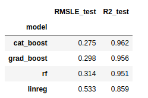

# Bicycle-rentals-predictor
In this project I built and trained different regression models(***Linear Regression, RandomForestRegressor,  GradientBoostingRegressor, CatBoostRegressor***) on the Capital Bike Share (Washington, D.C.) Kaggle data set, in order to predict demand for bicycle rentals.
CatBoostRegressor gave the lowest RMSLE and the highest R2 score.
